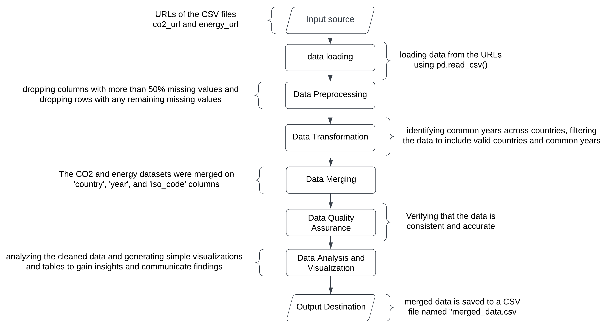

<!-- # Data Report -->

## Question

**What is the relationship between greenhouse gas emissions and energy production across different countries, and how does it vary based on regional, economic, and climatic factors?**

## Data Sources

### Datasource 1: CO2 and Greenhouse Gas Emissions
- **Description**: Provides comprehensive data on CO2 and greenhouse gas emissions for various countries over multiple years.
- **Source**: Our World in Data, accessible at [CO2 Data](https://github.com/owid/co2-data)
- **Content**: includes metrics such as country, year, population, GDP, total CO2 emissions, per capita emissions, and sector-specific emissions.
- **Data Structure and Quality**: The dataset is structured with columns for each metric and rows for each country's yearly data. Some missing values identified, particularly in sector-specific emissions.
- **License**: Data is open access under Creative Commons BY license.License details can be found [here](https://github.com/owid/co2-data?tab=readme-ov-file#license). 

### Datasource 2: Energy
- **Description**: Detailed data on energy production and consumption across various countries over several years.
- **Source**: Our World in Data, accessible at [Energy Data](https://github.com/owid/energy-data)
- **Content**: Metrics include country, year, population, GDP, total energy production, energy consumption by source, and sector-specific energy data.
- **Data Structure and Quality**: Similar to the CO2 dataset, this dataset is well-organized with columns for each energy metric and rows for annual country data. Some columns had missing values, primarily in renewable energy data.
- **License**: Data is open access under Creative Commons BY license. License details can be found [here](https://github.com/owid/energy-data?tab=readme-ov-file#license). 

## Data Pipeline

### Overview This extension has been disabled because the current workspace is not trusted.
- **Technology Used**: Python, Pandas
- **Description**: The data pipeline automates loading, cleaning, transforming, and analyzing data from multiple sources using Python and libraries like pandas to implement our data pipeline.
- **Pipeline Steps**:
  1. **Data Acquisition**: Datasets downloaded from GitHub repositories.
  2. **Data Preprocessing**: Handle missing values by dropping columns with over 50% missing data and rows with remaining missing values.
  3. **Data Transformation**: Determine common year range across all countries and extracting the minimum and maximum years. crucial for dataset filtering.
  4. **Data Merging**: Merge cleaned CO2 and energy datasets based on country, year, and ISO code.
  5. **Verification**: Ensure all selected countries have data for the same year range.
  
  

### Problems and Solutions
- **Non-Consecutive Years**: Initially, the dataset contained non-consecutive years. This was resolved by filtering the data to include only common years across all countries.
- **Missing Values**: Some columns had a significant amount of missing data. These were addressed by dropping columns with more than 50% missing values and rows with any remaining missing values.

### Error Handling
- The pipeline verifies the consistency of the merged data's year range across all countries, flagging any discrepancies.

## Result and Limitations

### Output Data
- **Description**: The output data is a cleaned and merged dataset containing CO2 emissions and energy production data for various countries from 2007 to 2016.
- **Data Structure and Quality**: The final dataset is well-structured, with columns representing different metrics of emissions and energy production, and rows representing annual data for each country. The quality of the data is high, with missing values handled effectively.
- **Data Format**: The output data is currently stored as CSV files locally due to its simplicity and compatibility with various data analysis tools. However, future plans involve storing the data on GitHub in the /data directory to ensure broader accessibility and version control.

### Critical Reflection
- **Potential Issues**:
  - **Data Gaps**: Although missing values were handled, there may still be some inconsistencies due to data gaps in the original sources.
  - **Scope**: The analysis is limited to the years 2007-2016. Trends outside this period are not captured.
  - **Focus**: While the analysis includes a global overview, the detailed analysis is meant to be limited to the 10 selected countries. This may not fully represent global dynamics.
  
  
  
  
  
  
  
  
## Figures and Tables

## 1. Data Quality Assessment
   - 
  
## 2. Data Quality Assessment
| Dataset                  | Initial Missing Values (%) | Missing Values After Cleaning (%) |
|--------------------------|----------------------------|-----------------------------------|
| CO2 Data | 55.24 | 0.0 |
| Energy Data | 67.42 | 0.0 |
  
  
## Conclusion

This data report outlines the steps taken to preprocess and clean the datasets, ensuring high-quality data for the analysis of the relationship between greenhouse gas emissions and energy production. The data pipeline effectively handles missing values and ensures consistent time periods across countries, providing a robust foundation for further analysis. Potential issues have been identified and addressed to the extent possible, with considerations for future work and analysis.
